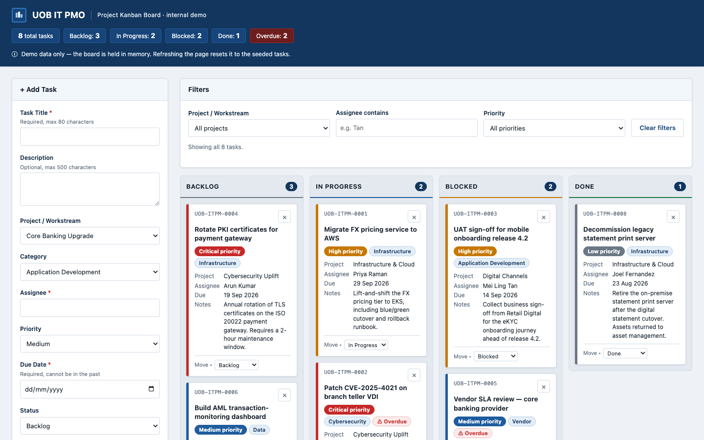

# UOB IT PMO — Project Kanban Board

A single-file IT project-management Kanban board for a fictional "UOB IT PMO". Tasks move
across four columns by drag-and-drop or a keyboard-accessible **Move ▸** menu, with live
counts, filters and overdue tracking. Built as an internal demo / training tool — one
`index.html`, no frameworks, no build step, no dependencies.

**Live demo:** https://ashoksamaldev.github.io/Claude-IT_Project-Dashboard/



## Features

- **Four-column board** — Backlog, In Progress, Blocked, Done, each with a live count badge.
- **Drag and drop** between columns, with a drop-target highlight.
- **Keyboard-accessible alternative** — every card carries a "Move ▸" select, so the board is
  fully usable without a pointer.
- **Add Task form** with title, description, project/workstream, category, assignee, priority,
  due date and starting status. Validation is inline: required title, assignee and due date,
  a due date that cannot be in the past, and per-field error text under the offending input.
- **Filters** by project/workstream, assignee substring and priority, plus a "Clear filters"
  button and a running "showing *n* of *m* tasks" line.
- **Overdue tracking** — any task past its due date that is not Done gets an ⚠ Overdue pill,
  and the header keeps a live overdue count.
- **Header summary strip** — total tasks, a per-status breakdown and overdue count, recomputed
  on every change. Note the deliberate asymmetry: the summary strip always counts *all* tasks,
  while the column badges and the filter line reflect the filtered subset.
- **Inline delete confirmation** — deleting a card renders a "Delete? Yes / No" row inside the
  card itself, not a browser dialog.
- **Priority colour coding** (Critical / High / Medium / Low) and category pills.
- **Toast notifications**, announced politely to screen readers via `aria-live`.
- **Responsive** — the sidebar and board stack below 768px.
- **Optional email notification** on task creation, via FormSubmit (see below).
- Seeded with 8 realistic sample tasks whose due dates are generated relative to today, so the
  Overdue badge always demonstrates correctly whenever you open the file.

## Running it locally

```sh
git clone https://github.com/ashoksamaldev/Claude-IT_Project-Dashboard.git
cd Claude-IT_Project-Dashboard
open index.html      # or just double-click it
```

There is nothing to install and no server to start — it runs straight from `file://`.

## Intentional behaviour (not bugs)

- **No persistence, by design.** The board is held in memory only. Refreshing resets it to the
  seed data — the notice in the header says so. There is no `localStorage`, no cookies, no
  backend.
- **The email notification fails out of the box.** `FORMSUBMIT_ENDPOINT` (near the top of the
  script block) ships with a `YOUR_EMAIL@example.com` placeholder. FormSubmit also requires a
  one-time activation: the first request sends a confirmation email to the configured address,
  and nothing is delivered until that link is clicked. Until you set a real address and
  activate it, adding a task shows the amber *"Card added locally — email notification failed"*
  toast. That is the optimistic-UI path working as intended: the card is added and the form
  reset *before* the network call, so a FormSubmit failure can never break the board.

## Tech stack

Vanilla HTML, CSS and JavaScript in one file. No React/Vue/jQuery, no bundler, no npm, no CDN,
no web fonts and no image files loaded by the page — icons are inline SVG or Unicode glyphs, and
the type is the system font stack. (`docs/screenshot.png` above is documentation only;
`index.html` does not reference it and still runs standalone from `file://`.)
Deployed to GitHub Pages by a GitHub Actions workflow
(`.github/workflows/pages.yml`) that publishes the repository root as a static artifact.

## Disclaimer

This is an internal demo / training tool and **not an official UOB system**. It is not
affiliated with, endorsed by, or connected to United Overseas Bank. No UOB logo, trademark or
branding is used — the wordmark is neutral text with a generic glyph, and all data is fictional.
