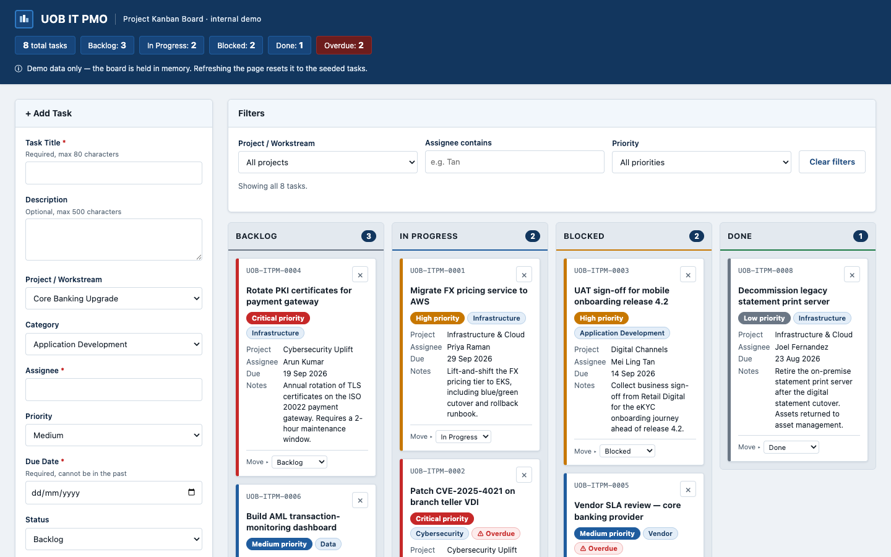

# UOB IT PMO — Project Kanban Board

A single-file IT project-management Kanban board for a fictional "UOB IT PMO". Tasks move
across four columns by drag-and-drop or a keyboard-accessible **Move ▸** menu, with live
counts, filters and overdue tracking. Built as an internal demo / training tool — one
`index.html`, no frameworks, no build step, no dependencies.

**Live demo:** https://ashoksamaldev.github.io/Claude-IT_Project-Dashboard/

### Current design


### Previous design

Kept for reference — the original blue palette, before the green revamp added WIP limits,
column sorting, collapsible notes and the Overdue-only filter.



## Features

- **Console-style overview** — a full-width row of metric tiles (total, per-status, overdue)
  beside a **Tasks by status** bar chart, leading the page at every screen width.
- **Four-column board** — Backlog, In Progress, Blocked, Done, each with a live count badge.
- **WIP limits** on In Progress and Blocked. A column over its limit is flagged in words, with a
  glyph and colour (“⚠ 5 of 4 — over WIP limit”). Going over warns; it never blocks a move.
  Backlog and Done are queues, so they are deliberately uncapped.
- **Cards sort themselves** within a column: overdue first, then priority, then soonest due date,
  so what is most likely to hurt sits at the top.
- **Collapsible notes** — a long description stays one click away instead of burying the title,
  assignee and due date under a wall of prose. The toggle is a real button with `aria-expanded`.
- **Drag and drop** between columns, with a drop-target highlight.
- **Keyboard-accessible alternative** — every card carries a "Move ▸" select, so the board is
  fully usable without a pointer.
- **Add Task form** with title, description, project/workstream, category, assignee, priority,
  due date and starting status. Validation is inline: required title, assignee and due date,
  a due date that cannot be in the past, and per-field error text under the offending input.
- **Filters** by project/workstream, assignee substring, priority and an “Overdue only” toggle,
  plus a "Clear filters" button and a running "showing *n* of *m* tasks" line.
- **Overdue tracking** — any task past its due date that is not Done gets an ⚠ Overdue pill,
  and the header keeps a live overdue count.
- **Metric tiles + chart** — total tasks, a per-status breakdown and an overdue count, recomputed
  on every change. Note the deliberate asymmetry: the overview always counts *all* tasks, while
  the column badges and the filter line reflect the filtered subset — the chart caption says so.
  The chart is hand-built inline SVG (no chart library, in keeping with the no-dependency rule):
  one hue, magnitude carried by bar length, every value labelled at the tip, and a visually
  hidden data table so the figures are never locked inside a picture.
- **Inline delete confirmation** — deleting a card renders a "Delete? Yes / No" row inside the
  card itself, not a browser dialog.
- **Priority colour coding** (Critical / High / Medium / Low) and category pills — always paired
  with a text label, never colour alone.
- **Toast notifications**, announced politely to screen readers via `aria-live`.
- **Responsive** — the form stacks above the board below 1100px so the columns keep their width,
  and the columns themselves stack below 768px. Touch targets reach 44px on the small layout.
- **Accessible by construction** — a measured focus ring on every control, no meaning carried by
  colour alone, and a contrast table checked against WCAG 2.1 rather than eyeballed.
- **Optional email notification** on task creation, via FormSubmit (see below).
- Seeded with 8 realistic sample tasks whose due dates are generated relative to today, so the
  Overdue badge always demonstrates correctly whenever you open the file.

## Running it locally

```sh
git clone https://github.com/ashoksamaldev/Claude-IT_Project-Dashboard.git
cd Claude-IT_Project-Dashboard
open index.html      # or just double-click it
```

There is nothing to install and no server to start — it runs straight from `file://`.

## Intentional behaviour (not bugs)

- **No persistence, by design.** The board is held in memory only. Refreshing resets it to the
  seed data — the notice in the header says so. There is no `localStorage`, no cookies, no
  backend.
- **The email notification fails out of the box.** `FORMSUBMIT_ENDPOINT` (near the top of the
  script block) ships with a `YOUR_EMAIL@example.com` placeholder. FormSubmit also requires a
  one-time activation: the first request sends a confirmation email to the configured address,
  and nothing is delivered until that link is clicked. Until you set a real address and
  activate it, adding a task shows the amber *"Card added locally — email notification failed"*
  toast. That is the optimistic-UI path working as intended: the card is added and the form
  reset *before* the network call, so a FormSubmit failure can never break the board.

## Security posture

There is no server, no session, no database and no dependency tree here, so most of the usual
web checklist does not apply — and saying so is a result, not a gap. What is actually defended:

- **Injection.** Cards are built as HTML strings, so `escapeHtml()` is load-bearing and every
  user-supplied value passes through it, including values interpolated into attributes such as
  `aria-label`. There are exactly three `innerHTML` sites and they are all escaped.
- **Display forgery.** `sanitizeText()` strips control characters and Unicode bidi overrides at
  the model boundary, so a task cannot be made to render differently from the value that is
  stored and emailed.
- **Exfiltration.** A `Content-Security-Policy` meta tag sets `default-src 'none'` and limits
  `connect-src` to `formsubmit.co`, so injected script has nowhere to send anything. `form-action`
  and `base-uri` are `'none'`. (`frame-ancestors` needs a real header, so clickjacking is not
  defended here.)
- **The outbound call.** The FormSubmit request is bounded by an `AbortController` timeout, sends
  no credentials and no referrer, and carries only fields the user typed — no environment,
  clipboard or identity data.
- **Impersonation.** The wordmark is plain text, the palette is generic, and the footer disclaimer
  is deliberate. This page names a real bank; a page that looked like an official UOB system on a
  public URL would be a phishing template regardless of intent.

Two properties are inherent to the design rather than defects, and are worth stating plainly: the
page has **no authentication** (anyone who opens it sees the demo board), and if you configure a
real FormSubmit address, **anyone who opens the published page can send mail to it**. The
client-side rate limit in the script is a speed bump against accidental floods, not a control —
the real control is FormSubmit's own settings.

## Tech stack

Vanilla HTML, CSS and JavaScript in one file. No React/Vue/jQuery, no bundler, no npm, no CDN,
no web fonts and no image files loaded by the page — icons are inline SVG or Unicode glyphs, and
the type is the system font stack. (`docs/screenshot.png` above is documentation only;
`index.html` does not reference it and still runs standalone from `file://`.)
Deployed to GitHub Pages by a GitHub Actions workflow
(`.github/workflows/pages.yml`) that publishes the repository root as a static artifact.

## Disclaimer

This is an internal demo / training tool and **not an official UOB system**. It is not
affiliated with, endorsed by, or connected to United Overseas Bank. No UOB logo, trademark or
branding is used — the wordmark is neutral text with a generic glyph, and all data is fictional.
